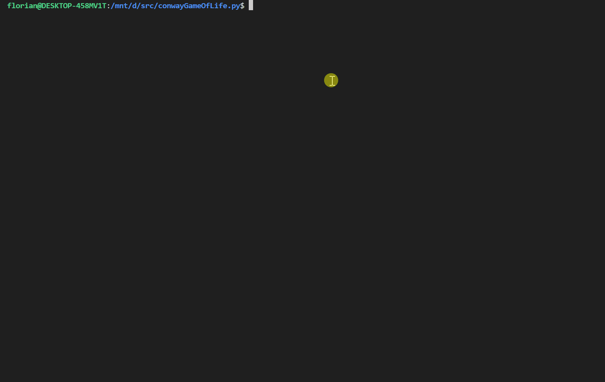

# **conwayGameOfLife**

Le jeu de la vie de John Horton Conway

> [!Note]
> Pour en connaître un peu plus, vous pouvez visiter la page **[Wikipedia](https://en.wikipedia.org/wiki/Conway%27s_Game_of_Life)** du jeu de la vie.

## Sommaire

- [**conwayGameOfLife**](#conwaygameoflife)
  - [Sommaire](#sommaire)
  - [Consignes](#consignes)
  - [Pré-requis](#pré-requis)
    - [Dépendances](#dépendances)
  - [Utilisations](#utilisations)
  - [Sauvegarde](#sauvegarde)
    - [Les entités](#les-entités)
  - [Exemples d'utilisations](#exemples-dutilisations)
    - [Aperçu](#aperçu)
    - [Remarque](#remarque)
  - [Licence](#licence)

## Consignes

La liste des consignes du sujet est disponible dans le [todo.md](todo.md)

[Sommaire](#sommaire)

## Pré-requis

L'installation de **[Python 3](https://www.python.org/downloads/)** est recommandé pour l'éxécution du script

> [!Note]
> Une fois l'installation de **[Python 3](https://www.python.org/downloads/)** terminée, tapez `$ pip install -r requirements.txt` dans un terminal à la racine du projets pour installer toutes les dépendances du projet

[Sommaire](#sommaire)

### Dépendances

- [base64](https://docs.python.org/3/library/base64.html)
- [json](https://docs.python.org/3/library/json.html)
- [keyboard](https://pypi.org/project/keyboard/) (For Windows system)
- [math](https://docs.python.org/3/library/math.html)
- [os](https://docs.python.org/3/library/os.html)
- [sys](https://docs.python.org/3/library/sys.html)
- [platform](https://docs.python.org/3/library/platform.html)
- [termios](https://docs.python.org/3/library/termios.html) (For Linux system)
- [tty](https://docs.python.org/3/library/tty.html) (For Linux system)
- [time](https://docs.python.org/3/library/time.html)
- [zlib](https://docs.python.org/3/library/zlib.html)

[Sommaire](#sommaire)

## Utilisations

| Fonctionnalités                     | Commandes                                                                                                    |
| ----------------------------------- | ------------------------------------------------------------------------------------------------------------ |
| Exécuter le script                  | `$ python main.py`                                                                                           |
| Insérer une ou plusieurs cellule(s) | `$ python main.py -a <mapName> "[(x, y), ...]"`<br />`$ python main.py --add <mapName> "[(x, y), ...]"`      |
| Insérer une entité                  | `$ python main.py -A <mapName> <type> <x> <y>`<br />`$ python main.py --add-entity <mapName> <type> <x> <y>` |
| Afficher une map enregistrée        | `$ python main.py -d <mapName>`<br />`$ python main.py --display <mapName>`                                  |
| Lister les maps sauvegardés         | `$ python main.py -l`<br />`$ python main.py --list`                                                         |
| Créer une nouvelle map              | `$ python main.py -n <mapName> <x> <y>`<br />`$ python main.py --new <mapName> <x> <y>`                      |
| Réinitialiser une map               | `$ python main.py -r <mapName>`<br />`$ python main.py --reset <mapName>`                                    |
| Jouer une map                       | `$ python main.py -s <mapName>`<br />`$ python main.py --start <mapName>`                                    |

[Sommaire](#sommaire)

## Sauvegarde

Les maps générées sont sauvegardées de manière automatique après chaque mise à jour de celle-ci dans un fichier **.map** portant le nom de la map dans le répertoire **[saves](saves/)** (_exemple: **[world.map](saves/world.map)**_)

[Sommaire](#sommaire)

### Les entités

De même que pour la map, les entités sont stockées dans le dossier **[entities](entities/)**

Si vous voulez ajouter des entités dans le fichier, vous pouvez le faire en suivant le formatage de positionnement relatif avec les coordonnées **x** et **y** comme dans l'exemple ci dessous pour l'entité "block":

```json
{
  "block": "[(x, y), (x, y+1), (x+1, y), (x+1, y+1)]"
}
```

[Sommaire](#sommaire)

## Exemples d'utilisations

On génère une nouvelle map qu'on va appeller "world" avec `$ python main.py -n world 50 50`

On ajoute les cellules active de sorte à former une entité:

- **Bloc**: `$ python main.py -a world "[(2,1), (2,2), (3,1), (3,2)]"`
- **Grenouille**: `$ python main.py -a world "[(2,1), (3,1), (4,2), (3,4), (2,4), (1,3)]"`
- **Planeur**: `$ python main.py -a world "[(1,1), (2,2), (2,3), (3,1), (3,2)]"`

Et on lance le jeu avec `$ python main.py` en entrant le nom de la map que l'on souhaite charger, ou bien le jeu avec la map souhaitée en entrant `$ python main.py -s world` directement

[Sommaire](#sommaire)

### Aperçu



[Sommaire](#sommaire)

### Remarque

- Vous pouvez checker votre configuration avec `$ python main.py -d world` pour afficher la map avec vos cellules actives
- Depuis la version 2.0, vous pouvez maintenant enregistrer une entité complète dans le dossier **[entities](entities)** et l'ajouter sur la map comme ceci:
  - **Départ de floraison**: `$ python main.py -A world flowering 25 25`
  - **Le clown**: `$ python main.py -A world clown 25 25`

> [!Tip]
> Si vous voulez entièrement la réinitialiser, `$ python main.py -r world` remet toutes les cellules d'une map à 0

[Sommaire](#sommaire)

## Licence

Code sous license [GPL v3](LICENSE)

[Sommaire](#sommaire)
